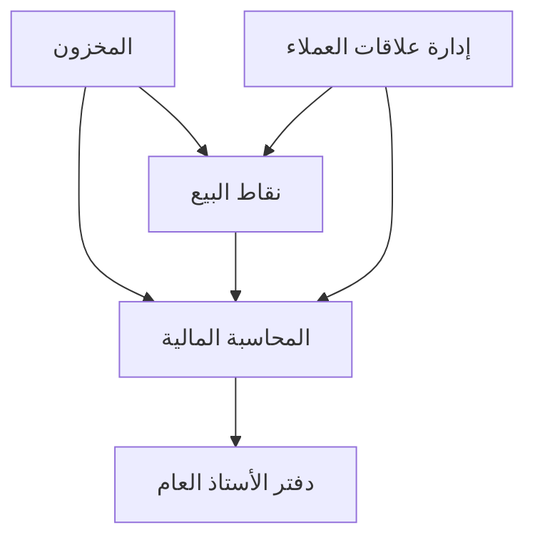

# وحدات بيج ليدجر

يوفر بيج ليدجر مجموعة شاملة من وحدات إدارة الأعمال المتكاملة المصممة لتبسيط العمليات وتحسين الكفاءة ودفع النمو للشركات من جميع الأحجام.

## الوحدات المتاحة

تتيح لك بنيتنا المعيارية اختيار وتنفيذ الوظائف التي تحتاجها فقط، مع المرونة لإضافة المزيد من الوحدات مع نمو أعمالك.

### وحدات تخطيط موارد المؤسسة الأساسية








## تكامل الوحدات

تم تصميم جميع وحدات بيج ليدجر للعمل بسلاسة معًا، ومشاركة البيانات في الوقت الفعلي والقضاء على الحاجة لإدخال البيانات المكررة.

## الفوائد الرئيسية

- **حل متكامل**: تعمل جميع الوحدات معًا بسلاسة
- **بيانات الوقت الفعلي**: تحديثات فورية عبر جميع الوحدات
- **هندسة قابلة للتوسع**: إضافة وحدات مع نمو أعمالك
- **أفضل الممارسات الصناعية**: سير عمل مدمج يستند إلى منهجيات مثبتة
- **قابل للتخصيص**: تكيف مع احتياجات أعمالك المحددة
- **دعم متعدد الشركات**: إدارة كيانات متعددة من نظام واحد
- **متعدد العملات**: دعم الأعمال العالمية
- **الامتثال التنظيمي**: ميزات امتثال مدمجة

## البدء

1. **تحديد احتياجاتك**: حدد الوحدات الأساسية لأعمالك
2. **البدء بالوحدات الأساسية**: ابدأ بالمحاسبة المالية وتوسع من هناك
3. **تكوين نظامك**: إعداد هيكل الشركة والمستخدمين والأذونات
4. **استيراد بياناتك**: نقل البيانات الموجودة إلى بيج ليدجر
5. **تدريب فريقك**: التأكد من تدريب جميع المستخدمين بشكل صحيح
6. **التشغيل الفعلي**: بدء استخدام بيج ليدجر في عملياتك اليومية

## الدعم

تحتاج مساعدة في اختيار الوحدات المناسبة لأعمالك؟ فريقنا هنا للمساعدة:

- 📧 [الاتصال بالمبيعات](mailto:sales@bigledger.com)
- 📚 [وثائق الوحدات](/docs/modules/)
- 🎥 [دروس الفيديو](/tutorials/)
- 💬 [منتدى المجتمع](https://forum.bigledger.com)