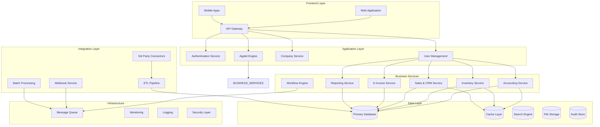
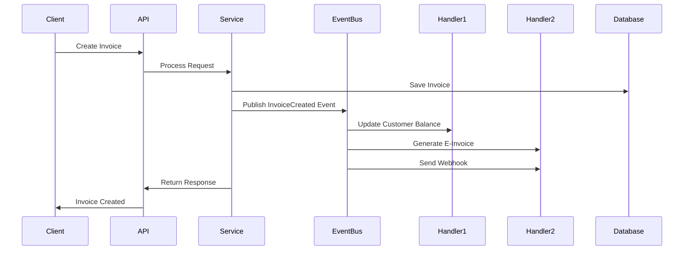
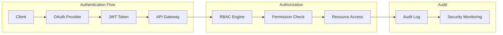
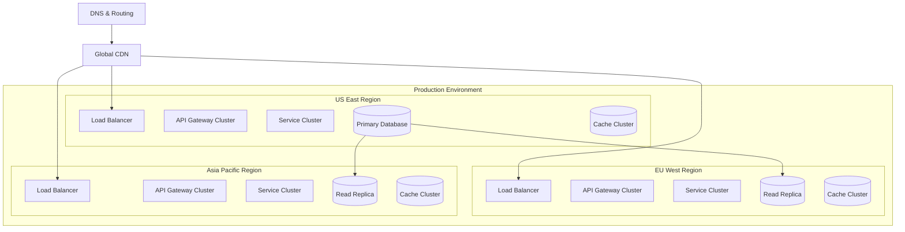

# BigLedger System Architecture

Comprehensive overview of BigLedger's system architecture, designed for enterprise architects, technical leads, and solution designers who need to understand how BigLedger fits into larger enterprise ecosystems.


**Enterprise-Grade Architecture**: BigLedger is built with a modern, cloud-native architecture that supports multi-tenancy, horizontal scaling, and enterprise integration patterns.


## Architecture Overview

BigLedger follows a **modular, microservices-based architecture** with the following key characteristics:

- **Angular-First Frontend**: Modular Angular applets with shared UI components
- **Microservices Backend**: Domain-driven service architecture
- **Event-Driven Communication**: Asynchronous messaging and real-time updates
- **Multi-Tenant SaaS**: Secure tenant isolation with shared infrastructure
- **Cloud-Native Design**: Container-based deployment with auto-scaling

## High-Level Architecture Diagram



## Core Architectural Patterns

### 1. Domain-Driven Design (DDD)

BigLedger is organized around business domains with clear boundaries:

```
Bounded Contexts:
├── Identity & Access Management
├── Company Management
├── Financial Accounting
├── Inventory Management
├── Sales & CRM
├── Purchasing
├── E-Invoice & Compliance
├── Reporting & Analytics
└── Integration & Automation
```

#### Domain Service Structure

```typescript
// Example: Inventory Domain
interface InventoryDomain {
  // Aggregates
  Product: ProductAggregate;
  InventoryItem: InventoryItemAggregate;
  StockMovement: StockMovementAggregate;
  
  // Domain Services
  StockValuationService: IStockValuationService;
  ReorderCalculationService: IReorderCalculationService;
  
  // Repositories
  ProductRepository: IProductRepository;
  InventoryRepository: IInventoryRepository;
  
  // Events
  StockLevelChangedEvent: DomainEvent;
  ProductCreatedEvent: DomainEvent;
}
```

### 2. Event-Driven Architecture

All business operations generate events that drive system behavior:



#### Event Schema

```typescript
interface DomainEvent {
  id: string;
  eventType: string;
  aggregateId: string;
  aggregateType: string;
  eventVersion: number;
  occurredOn: Date;
  correlationId: string;
  tenantId: string;
  userId: string;
  payload: any;
  metadata: EventMetadata;
}

interface EventMetadata {
  source: string;
  causationId?: string;
  ipAddress?: string;
  userAgent?: string;
  requestId: string;
}
```

### 3. CQRS (Command Query Responsibility Segregation)

Separate read and write models for optimal performance:

```typescript
// Write Model (Commands)
interface CreateInvoiceCommand {
  tenantId: string;
  customerId: string;
  items: InvoiceItemData[];
  dueDate: Date;
  notes?: string;
}

// Read Model (Queries)
interface InvoiceListQuery {
  tenantId: string;
  customerId?: string;
  status?: InvoiceStatus[];
  dateRange?: DateRange;
  pagination: PaginationOptions;
  sorting: SortOptions;
}

interface InvoiceProjection {
  id: string;
  invoiceNumber: string;
  customerName: string;
  total: Money;
  status: InvoiceStatus;
  dueDate: Date;
  overdueDays?: number;
}
```

## Multi-Tenancy Architecture

### Tenant Isolation Strategy

BigLedger uses **Schema-per-Tenant** isolation for maximum security and performance:

```sql
-- Database Structure
bigledger_platform/
├── shared/
│   ├── tenants
│   ├── users
│   ├── subscriptions
│   └── system_config
└── tenant_schemas/
    ├── tenant_001/
    │   ├── companies
    │   ├── accounts
    │   ├── transactions
    │   └── ...
    └── tenant_002/
        ├── companies
        ├── accounts  
        ├── transactions
        └── ...
```

### Tenant Context Management

```typescript
interface TenantContext {
  tenantId: string;
  schema: string;
  subscriptionPlan: SubscriptionPlan;
  features: EnabledFeatures[];
  limits: TenantLimits;
  timezone: string;
  locale: string;
  currency: CurrencyCode;
}

interface TenantLimits {
  maxCompanies: number;
  maxUsers: number;
  maxTransactions: number;
  apiRateLimit: number;
  storageQuota: number;
}
```

## Service Architecture

### Core Business Services

#### 1. Accounting Service

```typescript
interface AccountingService {
  // Chart of Accounts
  createAccount(command: CreateAccountCommand): Promise<Account>;
  updateAccount(command: UpdateAccountCommand): Promise<Account>;
  getAccountHierarchy(query: AccountHierarchyQuery): Promise<AccountTree>;
  
  // Journal Entries
  createJournalEntry(command: CreateJournalEntryCommand): Promise<JournalEntry>;
  postJournalEntry(command: PostJournalEntryCommand): Promise<void>;
  reverseJournalEntry(command: ReverseJournalEntryCommand): Promise<JournalEntry>;
  
  // Financial Reports
  generateTrialBalance(query: TrialBalanceQuery): Promise<TrialBalanceReport>;
  generateBalanceSheet(query: BalanceSheetQuery): Promise<BalanceSheetReport>;
  generateIncomeStatement(query: IncomeStatementQuery): Promise<IncomeStatementReport>;
}
```

#### 2. Inventory Service

```typescript
interface InventoryService {
  // Product Management
  createProduct(command: CreateProductCommand): Promise<Product>;
  updateProduct(command: UpdateProductCommand): Promise<Product>;
  getProducts(query: ProductListQuery): Promise<ProductList>;
  
  // Stock Management
  adjustStock(command: StockAdjustmentCommand): Promise<StockMovement>;
  transferStock(command: StockTransferCommand): Promise<StockMovement>;
  getStockLevels(query: StockLevelsQuery): Promise<StockLevel[]>;
  
  // Valuation
  calculateStockValuation(query: StockValuationQuery): Promise<StockValuationReport>;
}
```

### Integration Services

#### API Gateway Configuration

```yaml
# api-gateway.yaml
routes:
  - path: "/api/v1/auth/*"
    service: "authentication-service"
    middleware: ["rate-limiting", "cors"]
  
  - path: "/api/v1/companies/*"
    service: "company-service"
    middleware: ["authentication", "tenant-context", "authorization"]
  
  - path: "/api/v1/accounting/*"
    service: "accounting-service"
    middleware: ["authentication", "tenant-context", "authorization", "audit"]
  
  - path: "/api/v1/inventory/*"
    service: "inventory-service"
    middleware: ["authentication", "tenant-context", "authorization", "audit"]

middleware:
  authentication:
    type: "jwt"
    issuer: "https://auth.bigledger.com"
    
  authorization:
    type: "rbac"
    permissions: "api-permissions"
    
  rate-limiting:
    requests-per-minute: 1000
    burst-limit: 100
```

## Data Architecture

### Database Design

#### Primary Database (PostgreSQL)

```sql
-- Multi-tenant schema structure
CREATE SCHEMA tenant_001;

-- Core entities with audit fields
CREATE TABLE tenant_001.companies (
    id UUID PRIMARY KEY DEFAULT gen_random_uuid(),
    name VARCHAR(255) NOT NULL,
    registration_number VARCHAR(100),
    tax_number VARCHAR(100),
    currency_code VARCHAR(3) NOT NULL DEFAULT 'USD',
    timezone VARCHAR(100) NOT NULL DEFAULT 'UTC',
    created_at TIMESTAMP WITH TIME ZONE NOT NULL DEFAULT NOW(),
    updated_at TIMESTAMP WITH TIME ZONE NOT NULL DEFAULT NOW(),
    created_by UUID NOT NULL,
    updated_by UUID NOT NULL,
    version INTEGER NOT NULL DEFAULT 1
);

CREATE TABLE tenant_001.chart_of_accounts (
    id UUID PRIMARY KEY DEFAULT gen_random_uuid(),
    company_id UUID NOT NULL REFERENCES tenant_001.companies(id),
    account_code VARCHAR(20) NOT NULL,
    account_name VARCHAR(255) NOT NULL,
    account_type account_type_enum NOT NULL,
    parent_account_id UUID REFERENCES tenant_001.chart_of_accounts(id),
    is_active BOOLEAN NOT NULL DEFAULT TRUE,
    created_at TIMESTAMP WITH TIME ZONE NOT NULL DEFAULT NOW(),
    updated_at TIMESTAMP WITH TIME ZONE NOT NULL DEFAULT NOW(),
    UNIQUE(company_id, account_code)
);

CREATE TABLE tenant_001.transactions (
    id UUID PRIMARY KEY DEFAULT gen_random_uuid(),
    company_id UUID NOT NULL REFERENCES tenant_001.companies(id),
    transaction_date DATE NOT NULL,
    reference VARCHAR(100),
    description TEXT,
    total_amount DECIMAL(19,4) NOT NULL,
    currency_code VARCHAR(3) NOT NULL,
    status transaction_status_enum NOT NULL DEFAULT 'draft',
    created_at TIMESTAMP WITH TIME ZONE NOT NULL DEFAULT NOW(),
    updated_at TIMESTAMP WITH TIME ZONE NOT NULL DEFAULT NOW()
);
```

### Caching Strategy

```typescript
interface CacheStrategy {
  // Application Cache (Redis)
  userSessions: {
    ttl: 24 * 60 * 60; // 24 hours
    keyPattern: "session:{userId}:{sessionId}";
  };
  
  // Query Cache
  chartOfAccounts: {
    ttl: 60 * 60; // 1 hour
    keyPattern: "coa:{tenantId}:{companyId}";
    invalidateOn: ["AccountCreated", "AccountUpdated"];
  };
  
  // API Response Cache
  reports: {
    ttl: 15 * 60; // 15 minutes
    keyPattern: "report:{reportType}:{hash}";
    invalidateOn: ["TransactionPosted"];
  };
}
```

### Search Architecture (Elasticsearch)

```json
{
  "mappings": {
    "properties": {
      "tenant_id": { "type": "keyword" },
      "entity_type": { "type": "keyword" },
      "entity_id": { "type": "keyword" },
      "title": { 
        "type": "text",
        "analyzer": "standard"
      },
      "content": {
        "type": "text", 
        "analyzer": "standard"
      },
      "tags": { "type": "keyword" },
      "created_at": { "type": "date" },
      "metadata": {
        "type": "object",
        "dynamic": true
      }
    }
  }
}
```

## Security Architecture

### Authentication & Authorization



#### Role-Based Access Control (RBAC)

```typescript
interface Permission {
  id: string;
  resource: string;
  action: string; // create, read, update, delete
  conditions?: PermissionCondition[];
}

interface Role {
  id: string;
  name: string;
  description: string;
  permissions: Permission[];
  inherits?: Role[];
}

interface User {
  id: string;
  tenantId: string;
  email: string;
  roles: Role[];
  companyAccess: CompanyAccess[];
}

interface CompanyAccess {
  companyId: string;
  roles: Role[];
  permissions: Permission[];
}
```

### Data Protection

#### Encryption at Rest

```typescript
interface EncryptionStrategy {
  // Database encryption
  database: {
    algorithm: "AES-256-GCM";
    keyRotation: "monthly";
    fields: ["tax_number", "bank_account", "personal_data"];
  };
  
  // File encryption
  files: {
    algorithm: "AES-256-CBC";
    keyManagement: "AWS-KMS";
    fileTypes: ["documents", "reports", "backups"];
  };
  
  // API encryption
  api: {
    transport: "TLS-1.3";
    certificateValidation: "strict";
  };
}
```

## Scalability & Performance

### Horizontal Scaling

```yaml
# Kubernetes deployment configuration
apiVersion: apps/v1
kind: Deployment
metadata:
  name: accounting-service
spec:
  replicas: 3
  selector:
    matchLabels:
      app: accounting-service
  template:
    spec:
      containers:
      - name: accounting-service
        image: bigledger/accounting-service:v2.1.0
        resources:
          requests:
            memory: "256Mi"
            cpu: "250m"
          limits:
            memory: "512Mi" 
            cpu: "500m"
        env:
        - name: DATABASE_URL
          valueFrom:
            secretKeyRef:
              name: db-credentials
              key: url
---
apiVersion: v1
kind: Service
metadata:
  name: accounting-service
spec:
  selector:
    app: accounting-service
  ports:
  - port: 80
    targetPort: 3000
---
apiVersion: autoscaling/v2
kind: HorizontalPodAutoscaler
metadata:
  name: accounting-service-hpa
spec:
  scaleTargetRef:
    apiVersion: apps/v1
    kind: Deployment
    name: accounting-service
  minReplicas: 2
  maxReplicas: 10
  metrics:
  - type: Resource
    resource:
      name: cpu
      target:
        type: Utilization
        averageUtilization: 70
```

### Database Scaling

```typescript
interface DatabaseScaling {
  // Read Replicas
  readReplicas: {
    count: 3;
    regions: ["us-east-1", "eu-west-1", "ap-southeast-1"];
    lagTolerance: "1 second";
  };
  
  // Connection Pooling
  connectionPool: {
    maxConnections: 100;
    idleTimeout: "10 minutes";
    poolMode: "transaction";
  };
  
  // Partitioning Strategy
  partitioning: {
    transactions: {
      strategy: "range";
      column: "transaction_date";
      interval: "monthly";
    };
    audit_logs: {
      strategy: "hash";
      column: "tenant_id";
      partitions: 16;
    };
  };
}
```

## Monitoring & Observability

### Application Metrics

```typescript
interface MetricsCollection {
  // Business Metrics
  business: {
    transactions_per_minute: Counter;
    invoice_processing_time: Histogram;
    user_session_duration: Histogram;
    api_error_rate: Gauge;
  };
  
  // Technical Metrics
  technical: {
    database_connection_pool: Gauge;
    cache_hit_rate: Gauge;
    memory_usage: Gauge;
    cpu_utilization: Gauge;
  };
  
  // SLA Metrics
  sla: {
    api_response_time_p95: Histogram;
    service_availability: Gauge;
    error_budget_remaining: Gauge;
  };
}
```

### Distributed Tracing

```mermaid
gantt
    title Request Trace Timeline
    dateFormat X
    axisFormat %Lms
    
    section API Gateway
    Authentication : 0, 50
    
    section Accounting Service  
    Process Request : 50, 200
    Database Query : 100, 180
    
    section Event Bus
    Publish Event : 200, 220
    
    section Webhook Service
    Send Webhook : 220, 300
```



### Logging Strategy

```json
{
  "timestamp": "2024-01-15T10:30:00.000Z",
  "level": "info",
  "service": "accounting-service",
  "tenantId": "tenant_001",
  "userId": "user_123",
  "requestId": "req_456789",
  "traceId": "trace_abc123",
  "spanId": "span_def456",
  "event": "invoice_created",
  "message": "Invoice created successfully",
  "data": {
    "invoiceId": "inv_789",
    "customerId": "cust_456",
    "amount": 1250.00,
    "currency": "USD"
  },
  "duration": 145,
  "status": "success"
}
```

## Deployment Architecture

### Cloud Infrastructure



### Disaster Recovery

```typescript
interface DisasterRecoveryPlan {
  // Recovery Objectives
  rto: "4 hours"; // Recovery Time Objective
  rpo: "1 hour";  // Recovery Point Objective
  
  // Backup Strategy
  backups: {
    database: {
      frequency: "continuous";
      retention: "7 days point-in-time, 90 days daily";
      crossRegion: true;
    };
    files: {
      frequency: "realtime";
      retention: "30 days";
      encryption: true;
    };
  };
  
  // Failover Process
  failover: {
    automated: true;
    healthChecks: ["database", "api", "cache"];
    notificationChannels: ["slack", "email", "sms"];
  };
}
```

This architecture overview provides the foundation for understanding how BigLedger scales, ensures security, and maintains high availability for enterprise deployments. For specific implementation details, refer to the specialized architecture documents for each domain.