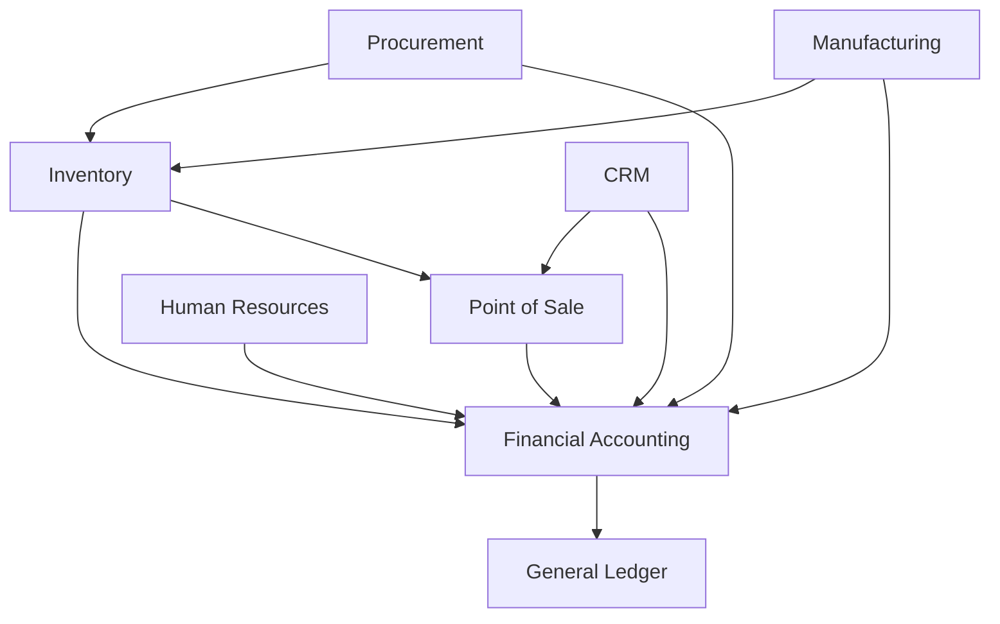

# BigLedger Modules

BigLedger provides a comprehensive suite of integrated business management modules designed to streamline operations, improve efficiency, and drive growth for businesses of all sizes.

## Available Modules

Our modular architecture allows you to select and implement only the functionality you need, with the flexibility to add more modules as your business grows.

### Core ERP Modules








### Operations Modules








## Module Integration

All BigLedger modules are designed to work seamlessly together, sharing data in real-time and eliminating the need for duplicate data entry.

## Key Benefits

- **Integrated Solution**: All modules work together seamlessly
- **Real-time Data**: Instant updates across all modules
- **Scalable Architecture**: Add modules as your business grows
- **Industry Best Practices**: Built-in workflows based on proven methodologies
- **Customizable**: Adapt to your specific business needs
- **Multi-company Support**: Manage multiple entities from one system
- **Multi-currency**: Global business support
- **Regulatory Compliance**: Built-in compliance features

## Getting Started

1. **Identify Your Needs**: Determine which modules are essential for your business
2. **Start with Core Modules**: Begin with Financial Accounting and expand from there
3. **Configure Your System**: Set up your company structure, users, and permissions
4. **Import Your Data**: Migrate existing data into BigLedger
5. **Train Your Team**: Ensure all users are properly trained
6. **Go Live**: Start using BigLedger for your daily operations

## Support

Need help choosing the right modules for your business? Our team is here to help:

- 📧 [Contact Sales](mailto:sales@bigledger.com)
- 📚 [Module Documentation](/modules/)
- 🎥 [Video Tutorials](/user-guide/)
- 💬 [Community Forum](https://forum.bigledger.com)