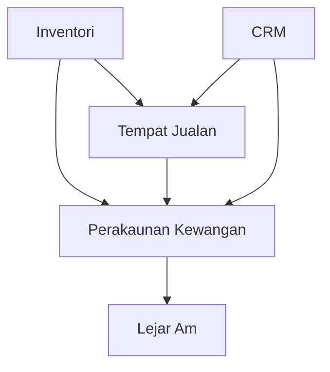

# Modul BigLedger

BigLedger menyediakan suite komprehensif modul pengurusan perniagaan bersepadu yang direka untuk mengurus operasi, meningkatkan kecekapan, dan mendorong pertumbuhan untuk perniagaan dari semua saiz.

## Modul Yang Tersedia

Seni bina modular kami membolehkan anda memilih dan melaksanakan hanya fungsi yang anda perlukan, dengan fleksibiliti untuk menambah lebih banyak modul seiring dengan pertumbuhan perniagaan anda.

### Modul ERP Teras








## Integrasi Modul

Semua modul BigLedger direka untuk berfungsi dengan lancar bersama-sama, berkongsi data dalam masa nyata dan menghapuskan keperluan untuk kemasukan data berganda.

## Faedah Utama

- **Penyelesaian Bersepadu**: Semua modul berfungsi bersama dengan lancar
- **Data Masa Nyata**: Kemaskini segera merentasi semua modul
- **Seni Bina Scalable**: Tambah modul seiring pertumbuhan perniagaan anda
- **Amalan Terbaik Industri**: Aliran kerja terbina dalam berdasarkan metodologi terbukti
- **Boleh Disesuaikan**: Adaptasi kepada keperluan perniagaan khusus anda
- **Sokongan Multi-syarikat**: Urus berbilang entiti dari satu sistem
- **Multi-mata wang**: Sokongan perniagaan global

## Bermula

1. **Kenal Pasti Keperluan Anda**: Tentukan modul yang penting untuk perniagaan anda
2. **Mulakan dengan Modul Teras**: Bermula dengan Perakaunan Kewangan dan berkembang dari situ
3. **Konfigurasikan Sistem Anda**: Sediakan struktur syarikat, pengguna, dan kebenaran
4. **Import Data Anda**: Pindahkan data sedia ada ke dalam BigLedger
5. **Latih Pasukan Anda**: Pastikan semua pengguna dilatih dengan betul
6. **Pergi Live**: Mula menggunakan BigLedger untuk operasi harian anda

## Sokongan

Memerlukan bantuan untuk memilih modul yang sesuai untuk perniagaan anda? Pasukan kami sedia membantu:

- 📧 [Hubungi Jualan](mailto:sales@bigledger.com)
- 📚 [Dokumentasi Modul](/docs/modules/)
- 🎥 [Tutorial Video](/tutorials/)
- 💬 [Forum Komuniti](https://forum.bigledger.com)