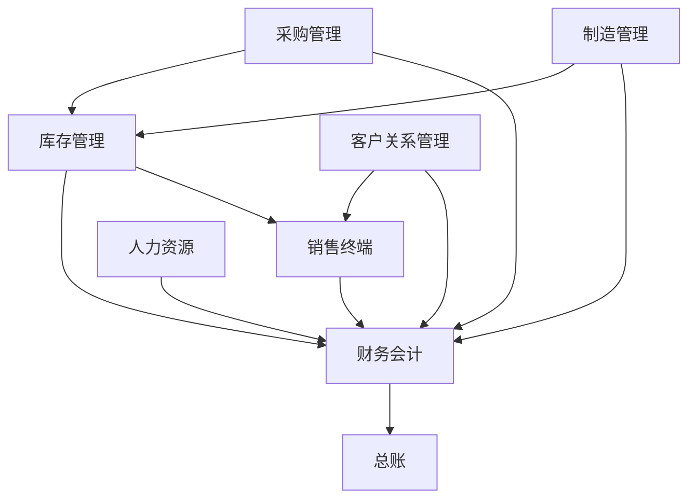

# BigLedger 模块

BigLedger 提供完整的集成式业务管理模块套件，旨在简化运营、提高效率，推动各种规模企业的发展。

## 可用模块

我们的模块化架构允许您仅选择和实施所需功能，并可随着业务增长灵活添加更多模块。

### 核心 ERP 模块








### 运营模块








## 模块集成

所有 BigLedger 模块都设计为无缝协作，实时共享数据，消除重复数据录入的需要。

## 主要优势

- **集成解决方案**：所有模块无缝协作
- **实时数据**：所有模块即时更新
- **可扩展架构**：随着业务增长添加模块
- **行业最佳实践**：基于成熟方法论的内置工作流
- **可定制**：适应您的特定业务需求
- **多公司支持**：从一个系统管理多个实体
- **多币种**：全球业务支持
- **合规要求**：内置合规功能

## 入门指南

1. **识别您的需求**：确定对您业务至关重要的模块
2. **从核心模块开始**：从财务会计开始，然后扩展
3. **配置您的系统**：设置公司结构、用户和权限
4. **导入您的数据**：将现有数据迁移到 BigLedger
5. **培训您的团队**：确保所有用户得到适当培训
6. **上线运行**：开始在日常运营中使用 BigLedger

## 支持

需要帮助为您的业务选择合适的模块？我们的团队随时为您提供帮助：

- 📧 [联系销售](mailto:sales@bigledger.com)
- 📚 [模块文档](/docs/modules/)
- 🎥 [视频教程](/tutorials/)
- 💬 [社区论坛](https://forum.bigledger.com)