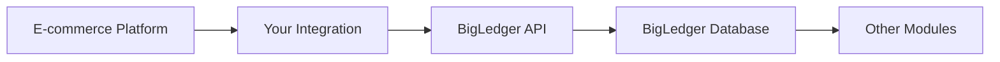

# Content Gap: Comprehensive API Documentation and Integration Examples

**Priority**: MEDIUM  
**Estimated Effort**: 2-3 days  
**Impact**: Enables developer adoption, third-party integrations, and custom solutions  

## Problem Statement

The current API documentation in `content/en/api-reference/` is minimal, containing only a basic index page. For a modern ERP platform like BigLedger, comprehensive API documentation is crucial for:

- Developer adoption and ecosystem growth
- Third-party integration partners
- Customer custom development projects
- System integrations and data exchange
- Competitive differentiation in technical evaluations

## Current State Analysis

### Existing API Content:
- `content/en/api-reference/_index.md` - Basic placeholder
- POS module contains some API examples
- No comprehensive API reference or integration guides

### Missing Critical Content:
- Complete API endpoint documentation
- Authentication and authorization guides
- SDK documentation and examples
- Integration patterns and best practices
- Webhook documentation
- Rate limiting and usage guidelines
- Error handling and troubleshooting

## Content Development Strategy

### Create Comprehensive API Documentation Section
**Directory**: `content/en/api-reference/`

**Enhanced Structure**:
```
content/en/api-reference/
├── _index.md (API overview and getting started)
├── authentication/
│   ├── _index.md (Authentication overview)
│   ├── api-keys.md (API key management)
│   ├── oauth.md (OAuth 2.0 implementation)
│   ├── permissions.md (API permission scopes)
│   └── security.md (Security best practices)
├── core-apis/
│   ├── _index.md (Core API overview)
│   ├── companies.md (Company and organization APIs)
│   ├── users.md (User management APIs)
│   ├── permissions.md (Permission and role APIs)
│   └── system.md (System information APIs)
├── module-apis/
│   ├── _index.md (Module APIs overview)
│   ├── accounting/
│   │   ├── _index.md (Accounting APIs overview)
│   │   ├── chart-of-accounts.md (COA management)
│   │   ├── journal-entries.md (Transaction posting)
│   │   ├── reports.md (Financial reporting APIs)
│   │   └── reconciliation.md (Bank reconciliation)
│   ├── inventory/
│   │   ├── _index.md (Inventory APIs overview)
│   │   ├── items.md (Item management)
│   │   ├── stock.md (Stock levels and movements)
│   │   ├── adjustments.md (Stock adjustments)
│   │   └── transfers.md (Stock transfers)
│   ├── pos/
│   │   ├── _index.md (POS APIs overview)
│   │   ├── sales.md (Sales transactions)
│   │   ├── payments.md (Payment processing)
│   │   ├── returns.md (Return processing)
│   │   └── reports.md (POS reporting)
│   ├── ecommerce/
│   │   ├── _index.md (E-commerce APIs overview)
│   │   ├── ecomsync.md (EcomSync integration)
│   │   ├── products.md (Product synchronization)
│   │   ├── orders.md (Order management)
│   │   └── inventory-sync.md (Inventory synchronization)
│   └── crm/
│       ├── _index.md (CRM APIs overview)
│       ├── customers.md (Customer management)
│       ├── contacts.md (Contact management)
│       ├── activities.md (Activity tracking)
│       └── sales-pipeline.md (Sales pipeline)
├── webhooks/
│   ├── _index.md (Webhook overview)
│   ├── configuration.md (Webhook setup and management)
│   ├── events.md (Available webhook events)
│   ├── security.md (Webhook security and verification)
│   └── troubleshooting.md (Webhook debugging)
├── sdks-libraries/
│   ├── _index.md (SDK overview)
│   ├── javascript.md (JavaScript/Node.js SDK)
│   ├── python.md (Python SDK)
│   ├── php.md (PHP SDK)
│   ├── java.md (Java SDK)
│   └── dotnet.md (.NET SDK)
├── integration-guides/
│   ├── _index.md (Integration patterns overview)
│   ├── getting-started.md (First API integration)
│   ├── common-patterns.md (Common integration patterns)
│   ├── data-synchronization.md (Real-time data sync)
│   ├── bulk-operations.md (Batch processing)
│   ├── error-handling.md (Error handling strategies)
│   └── rate-limiting.md (Rate limiting and optimization)
├── examples/
│   ├── _index.md (Code examples overview)
│   ├── basic-operations.md (CRUD operations)
│   ├── data-import.md (Data import examples)
│   ├── reporting.md (Report generation examples)
│   ├── ecommerce-sync.md (E-commerce synchronization)
│   └── custom-workflows.md (Custom business workflows)
└── reference/
    ├── _index.md (API reference overview)
    ├── endpoints.md (Complete endpoint listing)
    ├── data-models.md (Data structure reference)
    ├── error-codes.md (API error code reference)
    ├── rate-limits.md (Rate limiting details)
    └── changelog.md (API version history)
```

## Key Content Areas to Develop

### 1. Authentication and Getting Started
**File**: `content/en/api-reference/_index.md`

**Structure**:
```markdown
# BigLedger API Documentation

## Overview
BigLedger provides a comprehensive REST API that allows developers to integrate with all core platform functionality.

## Quick Start
### 1. Get API Credentials
- How to obtain API keys
- Permission scopes overview
- Test vs. production environments

### 2. Make Your First Request
```javascript
// Example API call
const response = await fetch('https://api.bigledger.com/v1/companies', {
  headers: {
    'Authorization': 'Bearer YOUR_API_KEY',
    'Content-Type': 'application/json'
  }
});
```

### 3. Common Use Cases
- Data synchronization
- Custom reporting
- E-commerce integration
- Third-party tool integration

## API Principles
- RESTful design
- JSON request/response format
- OAuth 2.0 authentication
- Rate limiting and pagination
- Webhook event notifications
```

### 2. Module-Specific API Documentation
**Example File**: `content/en/api-reference/module-apis/inventory/items.md`

**Structure**:
```markdown
# Inventory Item Management API

## Overview
Manage inventory items, including creation, updates, variants, and pricing.

## Endpoints

### List Items
```http
GET /api/v1/inventory/items
```

**Parameters:**
| Parameter | Type | Description | Required |
|-----------|------|-------------|----------|
| page | integer | Page number (default: 1) | No |
| limit | integer | Items per page (max: 100) | No |
| category | string | Filter by category | No |
| active | boolean | Filter by active status | No |

**Response:**
```json
{
  "data": [
    {
      "id": "item_123",
      "sku": "PROD-001",
      "name": "Product Name",
      "category": "Electronics",
      "price": 29.99,
      "stock_quantity": 150,
      "active": true,
      "created_at": "2024-01-01T00:00:00Z"
    }
  ],
  "pagination": {
    "page": 1,
    "limit": 20,
    "total": 245,
    "pages": 13
  }
}
```

### Create Item
```http
POST /api/v1/inventory/items
```

**Request Body:**
```json
{
  "sku": "PROD-002",
  "name": "New Product",
  "description": "Product description",
  "category": "Electronics",
  "price": 49.99,
  "cost": 30.00,
  "stock_quantity": 100,
  "reorder_point": 10,
  "active": true
}
```

**Response:**
```json
{
  "id": "item_124",
  "sku": "PROD-002",
  "name": "New Product",
  "status": "created",
  "created_at": "2024-01-01T00:00:00Z"
}
```

## Error Handling
Common error responses and how to handle them.

## Code Examples
Real-world usage examples in multiple programming languages.
```

### 3. Integration Guide Examples
**File**: `content/en/api-reference/integration-guides/ecommerce-sync.md`

**Structure**:
```markdown
# E-commerce Integration Guide

## Overview
Complete guide to integrating BigLedger with e-commerce platforms using the API.

## Integration Pattern


## Step-by-Step Implementation

### 1. Product Synchronization
```javascript
// Sync products from e-commerce to BigLedger
async function syncProducts(ecommerceProducts) {
  for (const product of ecommerceProducts) {
    const bigLedgerItem = {
      sku: product.sku,
      name: product.name,
      price: product.price,
      stock_quantity: product.stock
    };
    
    await createOrUpdateItem(bigLedgerItem);
  }
}
```

### 2. Order Processing
```javascript
// Process new orders from e-commerce platform
async function processOrder(ecommerceOrder) {
  // Create sales transaction in BigLedger
  const saleData = {
    customer_id: await getOrCreateCustomer(ecommerceOrder.customer),
    items: ecommerceOrder.items.map(item => ({
      product_id: item.sku,
      quantity: item.quantity,
      price: item.price
    })),
    payment_method: ecommerceOrder.payment_method
  };
  
  const sale = await createSale(saleData);
  
  // Update inventory levels
  await updateInventoryLevels(ecommerceOrder.items);
  
  return sale;
}
```

### 3. Real-time Synchronization with Webhooks
```javascript
// Set up webhook handler for inventory updates
app.post('/webhook/inventory-update', (req, res) => {
  const inventoryUpdate = req.body;
  
  // Update e-commerce platform inventory
  updateEcommerceInventory(inventoryUpdate);
  
  res.status(200).send('OK');
});
```

## Best Practices
- Error handling and retry logic
- Rate limiting considerations
- Data validation and sanitization
- Security and authentication

## Testing and Validation
- Test data setup
- Validation procedures
- Common issues and solutions
```

## Questions for Vincent

### API Maturity and Capabilities
1. **API Completeness**: How complete is the current API coverage across all modules?
2. **API Design**: Is the API RESTful, GraphQL, or a hybrid approach?
3. **Authentication**: What authentication methods are supported (API keys, OAuth, JWT)?
4. **Versioning**: How is API versioning handled and what versions are currently supported?

### Developer Ecosystem
5. **SDK Availability**: Are there official SDKs for popular programming languages?
6. **Developer Tools**: Are there tools like API explorers, testing environments, or Postman collections?
7. **Developer Community**: Is there a developer community or partner program?
8. **Integration Partners**: What third-party integrations exist and how are they documented?

### Technical Implementation
9. **Rate Limiting**: What are the current rate limits and how are they enforced?
10. **Webhooks**: What webhook events are available and how reliable is the webhook system?
11. **Real-time Features**: Are there real-time APIs (WebSockets, Server-Sent Events) for live data?
12. **Bulk Operations**: What bulk operation capabilities exist for large data sets?

### Business and Commercial
13. **API Pricing**: Is API access included in all plans or is there separate pricing?
14. **Usage Analytics**: What analytics are available for API usage and performance?
15. **Support Model**: What API support is provided (documentation, developer support, SLAs)?
16. **Competitive Positioning**: How does BigLedger's API compare to competitors?

### Content Strategy
17. **Target Developers**: Who are the primary developer audiences (customer developers, partners, internal)?
18. **Use Case Priorities**: What are the most common API use cases that should be prioritized?
19. **Example Preferences**: What types of code examples would be most valuable?
20. **Interactive Documentation**: Would interactive API documentation (like Swagger UI) be beneficial?

## Success Criteria

### Developer Adoption
- [ ] Increased API usage and developer sign-ups
- [ ] Reduced API support tickets
- [ ] Higher developer satisfaction scores
- [ ] More third-party integrations

### Content Quality
- [ ] Complete API endpoint documentation
- [ ] Working code examples for all major use cases
- [ ] Comprehensive integration guides
- [ ] Regular updates with new API features

### Business Impact
- [ ] Faster partner integrations
- [ ] Reduced custom development costs
- [ ] Competitive advantage in technical evaluations
- [ ] Ecosystem growth and partner revenue

## Implementation Timeline

**Week 1**:
- API audit and capability assessment
- Core API documentation structure
- Authentication and getting started guide

**Week 2**:
- Module-specific API documentation
- Integration guide development
- Code examples and SDKs

**Week 3**:
- Webhook and real-time feature documentation
- Developer tools and resources
- Testing and validation with developer team

## Integration with Existing Content

### Cross-References
- Link API docs to corresponding module documentation
- Include API examples in feature documentation
- Reference troubleshooting guides for API errors
- Connect to implementation guides for API setup

### Developer Journey
1. **Discovery**: API overview and capabilities
2. **Getting Started**: Authentication and first API call
3. **Implementation**: Module-specific API usage
4. **Integration**: Complete integration patterns
5. **Advanced**: Webhooks, bulk operations, optimization
6. **Support**: Troubleshooting and community resources

## Notes

Comprehensive API documentation is essential for BigLedger's developer ecosystem and competitive positioning. The documentation should be practical, example-rich, and regularly updated to reflect the current API capabilities. Consider interactive documentation tools to enhance the developer experience.