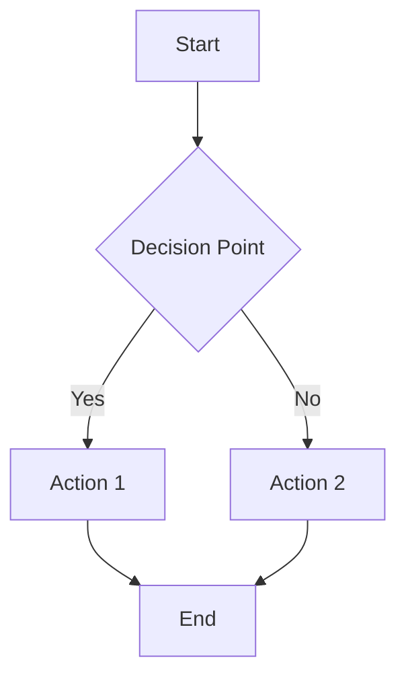

# BigLedger Documentation Style Guide

## Overview

This style guide ensures consistency, clarity, and professionalism across all BigLedger documentation. It establishes standards for writing style, formatting, structure, and visual presentation.

## Writing Style Standards

### Voice and Tone

**Professional but Approachable**
- Use active voice: "Configure the settings" not "The settings can be configured"
- Write in second person: "You can access the dashboard" not "Users can access the dashboard"
- Be conversational but professional: Avoid overly formal language
- Stay positive and solution-focused

**Examples**:
```markdown
✅ Good: "You can quickly set up your inventory tracking by following these steps."
❌ Avoid: "It is possible for users to configure inventory tracking functionality."
```

### Language and Terminology

**Clarity and Consistency**
- Use simple, clear language that translates well
- Define technical terms on first use
- Maintain consistent terminology throughout
- Avoid idioms and cultural references
- Use American English spelling

**BigLedger-Specific Terms**:
- **BigLedger** (not BigLedger ERP, BL, or variations)
- **Applet** (not app, application, or module when referring to BigLedger applets)
- **Module** (for major functional areas like Accounting, POS, Inventory)
- **Dashboard** (not home screen, main page)
- **Workspace** (for user's working environment)

**Common Terms to Standardize**:
- Chart of Accounts (COA)
- Point of Sales (POS) - not Point of Sale
- E-invoice (not eInvoice, e-Invoice)
- MyInvois (official Malaysian government spelling)
- PEPPOL (all caps)
- AI Matrix (two words, not AIMatrix)

### Accessibility and Translation

**Write for Global Audience**
- Use simple sentence structures
- Avoid complex compound sentences
- Define acronyms: "Enterprise Resource Planning (ERP)"
- Use parallel structure in lists
- Avoid cultural references or humor

**Technical Accuracy**
- Be precise with technical terms
- Include version numbers when relevant
- Use consistent formatting for UI elements
- Provide context for screenshots
- Include alternative text for images

## Content Structure Standards

### Page Organization

**Consistent Page Structure**:
```markdown
---
title: "Page Title"
description: "Brief description for SEO and navigation"
weight: 10 (for ordering in navigation)
---

# Page Title

## Overview
Brief introduction explaining what this page covers

## Key Concepts (if needed)
Define important concepts before diving into details

## Main Content Sections
Organize content logically with clear headings

## Next Steps (if applicable)
Guide users to related content or next actions
```

### Heading Hierarchy

**Use Consistent Heading Levels**:
- H1 (`#`): Page title only (automatically generated from frontmatter)
- H2 (`##`): Major sections
- H3 (`###`): Subsections
- H4 (`####`): Sub-subsections (use sparingly)
- H5-H6: Avoid unless absolutely necessary

**Heading Style**:
```markdown
## Good Heading Style
### Sub-section with Clear Purpose
#### Specific Implementation Detail

❌ Avoid generic headings like:
## Information
## Details
## Other
```

### Content Flow

**Information Architecture**:
1. **Overview**: What and why
2. **Prerequisites**: What's needed first
3. **Procedures**: Step-by-step how-to
4. **Examples**: Real-world applications
5. **Troubleshooting**: Common issues
6. **Next Steps**: What to do next

## Formatting Standards

### Code and Technical Elements

**Code Blocks**:
```markdown
Use triple backticks with language specification:

```javascript
// JavaScript example
const config = {
  apiKey: "your-api-key",
  baseUrl: "https://api.bigledger.com"
};
```

```yaml
# YAML configuration example
settings:
  currency: USD
  timezone: America/New_York
```
```

**Inline Code**:
- Use `backticks` for: file names, field names, menu items, buttons
- Examples: Click the `Save` button, navigate to `Settings > Users`

**UI Elements**:
- **Bold** for emphasis and important concepts
- `Code formatting` for UI elements, file paths, field names
- Use → for navigation paths: `Settings → Users → Permissions`

### Lists and Procedures

**Step-by-Step Procedures**:
```markdown
### Setting Up Your Company

1. **Navigate to Organization Setup**
   - Go to `Settings → Organization → Company`
   - Click the `Create Company` button

2. **Enter Company Information**
   - Company name (required)
   - Tax ID number
   - Business registration number
   - Default currency

3. **Configure Regional Settings**
   - Select your country/region
   - Set time zone
   - Choose date/time formats
```

**Bulleted Lists for Features**:
```markdown
### Key Features

- **Real-time Synchronization**: Data updates across all modules instantly
- **Multi-currency Support**: Handle transactions in multiple currencies
- **Role-based Access**: Granular permission controls for different user types
- **Audit Trail**: Complete transaction history for compliance
```

### Links and Cross-References

**Internal Links**:
```markdown
- Absolute paths for cross-references: [Financial Accounting](/modules/financial-accounting/)
- Section links: [Chart of Accounts Setup](#chart-of-accounts-setup)
- Guide references: For detailed procedures, see the [User Management Guide](/guides/user-management/)
```

**External Links**:
```markdown
- Open in new window for external sites: [PEPPOL Official Site](https://peppol.eu){:target="_blank"}
- Include context: Learn more about Malaysian e-invoicing at [MDEC's official page](https://mdec.my/myinvois){:target="_blank"}
```

## Visual Content Standards

### Screenshots and Images

**Screenshot Guidelines**:
- Use consistent browser/application appearance
- Include enough context to orient users
- Highlight important areas with callouts or borders
- Use consistent styling for annotations
- Optimize file sizes for web delivery
- Include alt text for accessibility

**File Naming Convention**:
```
/images/module-name/feature-name-description.png

Examples:
/images/accounting/chart-of-accounts-setup.png
/images/pos/payment-methods-configuration.png
/images/inventory/stock-take-mobile-interface.png
```

**Image Markdown**:
```markdown


Example:

```

### Diagrams and Flowcharts

**Use Mermaid for Diagrams**:
```markdown

```

**Diagram Types**:
- **Flowcharts**: For processes and workflows
- **System Diagrams**: For architecture and integrations
- **Organization Charts**: For user roles and hierarchies
- **Sequence Diagrams**: For API interactions

### Tables

**Consistent Table Formatting**:
```markdown
| Feature | Description | Availability |
|---------|-------------|--------------|
| Real-time Sync | Data synchronization across modules | All plans |
| Multi-currency | Handle multiple currencies | Pro and Enterprise |
| Custom Reports | Create custom report templates | Enterprise only |
```

**Table Guidelines**:
- Use tables for structured data comparison
- Keep table content concise
- Align content appropriately (numbers right-aligned)
- Include headers for all columns
- Consider mobile responsiveness

## Content Types and Templates

### Module Documentation Template

```markdown
---
title: "Module Name"
description: "Brief description of module purpose and capabilities"
weight: 10
---

# Module Name

## Overview
Brief explanation of what this module does and who uses it.

## Key Features
### Major Feature Category
- Feature 1 with brief description
- Feature 2 with brief description

### Another Feature Category
- Additional features

## Getting Started
Basic setup and configuration steps.

## Common Use Cases
Real-world scenarios and applications.

## Integration
How this module connects with others.

## Advanced Features
Complex configurations and customizations.

## Troubleshooting
Common issues and solutions.

## API Reference
Technical integration information.
```

### Guide Documentation Template

```markdown
---
title: "Guide Title"
description: "What this guide teaches and who it's for"
weight: 10
---

# Guide Title

## What You'll Learn
Clear learning objectives and outcomes.

## Prerequisites
- Required access levels
- Prerequisite knowledge or setup
- Required information or data

## Overview
Brief explanation of the process or concept.

## Step-by-Step Instructions
Detailed procedures with examples.

## Examples
Real-world scenarios and use cases.

## Best Practices
Tips and recommendations for success.

## Troubleshooting
Common issues and solutions.

## Next Steps
What to do after completing this guide.
```

## SEO and Discoverability

### Page Titles and Descriptions

**Title Format**:
```yaml
title: "Specific Feature Name - BigLedger Module"
# Examples:
title: "Chart of Accounts Setup - Financial Accounting"
title: "Stock Take Procedures - Inventory Management"
title: "EcomSync Configuration - E-commerce Integration"
```

**Description Format**:
```yaml
description: "Action-oriented description with key benefits and target audience"
# Examples:
description: "Learn how to set up your chart of accounts in BigLedger for accurate financial reporting and compliance"
description: "Complete guide to configuring EcomSync for Shopee and Lazada integration with real-time inventory sync"
```

### Content Optimization

**Search-Friendly Content**:
- Include relevant keywords naturally
- Use descriptive headings that match search intent
- Provide comprehensive coverage of topics
- Include related terms and synonyms
- Create content clusters around major topics

**Internal Linking Strategy**:
- Link to related content contextually
- Use descriptive anchor text
- Create topic clusters with hub pages
- Ensure important pages are well-connected

## Quality Assurance

### Review Checklist

**Content Review**:
- [ ] Clear purpose and audience
- [ ] Accurate and up-to-date information
- [ ] Consistent with style guide
- [ ] Proper formatting and structure
- [ ] Working links and references
- [ ] Appropriate visual content

**Technical Review**:
- [ ] Procedures tested and validated
- [ ] Screenshots current and accurate
- [ ] Code examples functional
- [ ] API references current
- [ ] Cross-browser compatibility

**Editorial Review**:
- [ ] Grammar and spelling
- [ ] Consistent terminology
- [ ] Clear and concise writing
- [ ] Appropriate tone and voice
- [ ] Translation-friendly language

### Maintenance Standards

**Regular Updates**:
- Review quarterly for accuracy
- Update screenshots with UI changes
- Validate procedures with new releases
- Check and fix broken links
- Update version-specific information

**Version Control**:
- Document significant changes
- Maintain change history
- Tag major revisions
- Archive outdated content appropriately

## Tools and Resources

### Recommended Tools

**Writing and Editing**:
- Hugo for static site generation
- Markdown for content creation
- Grammarly for grammar and style checking
- Hemingway Editor for readability

**Visual Content**:
- Snagit or similar for screenshots
- Figma or Canva for diagrams
- TinyPNG for image optimization
- Mermaid for technical diagrams

**Validation**:
- Link checkers for broken links
- Accessibility checkers for compliance
- Mobile responsiveness testing
- Cross-browser validation

### Reference Resources

**Style References**:
- [Google Developer Documentation Style Guide](https://developers.google.com/style)
- [Microsoft Writing Style Guide](https://docs.microsoft.com/en-us/style-guide/)
- [Mailchimp Content Style Guide](https://styleguide.mailchimp.com/)

**Technical Writing**:
- [Plain Language Guidelines](https://www.plainlanguage.gov/guidelines/)
- [Nielsen Norman Group UX Writing](https://www.nngroup.com/articles/writing-digital-interfaces/)

## Conclusion

This style guide is a living document that should evolve with BigLedger's documentation needs. Regular review and updates ensure consistency and quality across all content.

For questions about style guide implementation or suggestions for improvements, contact the documentation team.

---

**Version**: 1.0  
**Last Updated**: December 2024  
**Next Review**: March 2025